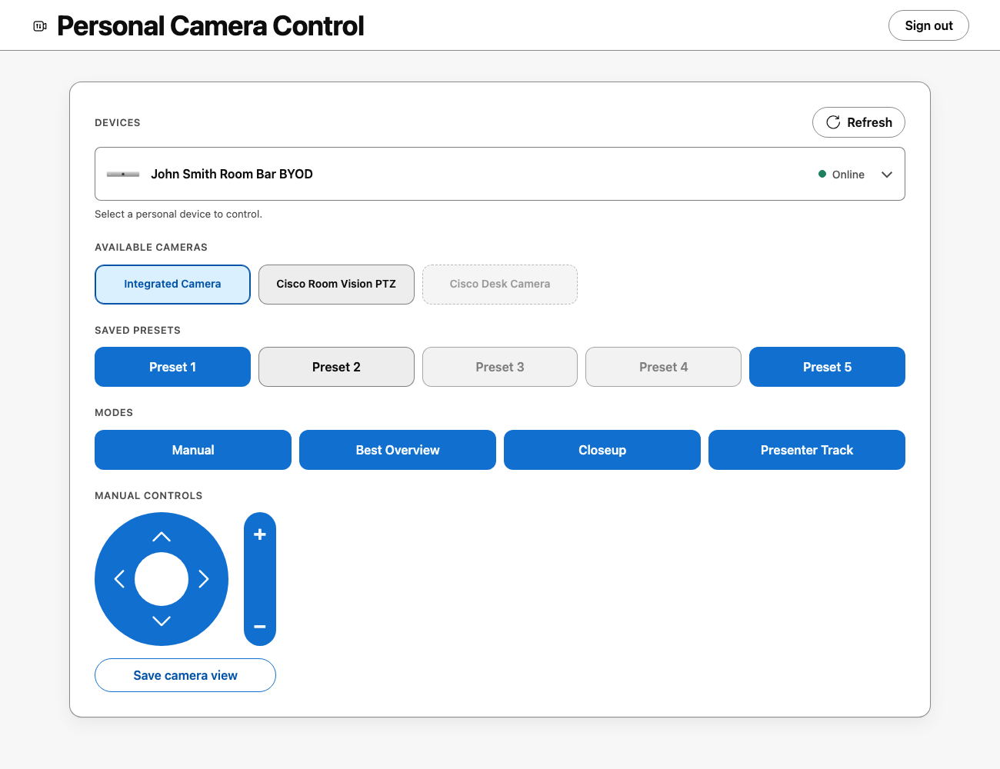
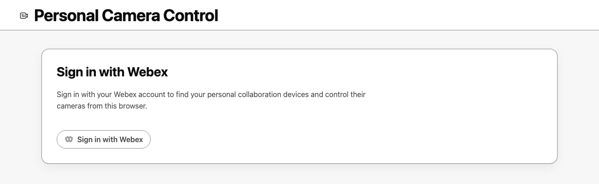
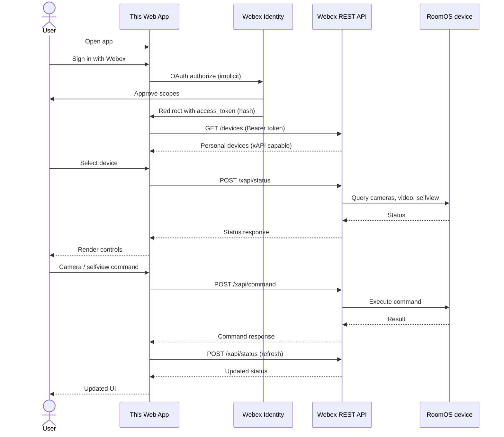

# Personal Camera Control

A browser-based example app for controlling the camera on your personal Cisco Collaboration device (RoomOS in Personal Mode). Sign in with Webex, pick your device, and adjust camera modes, presets, manual pan/tilt/zoom, and selfview—all from a static web page with no server-side application code.

<a href="https://wxsd-sales.github.io/personal-camera-control">
  <picture>
    <source media="(prefers-color-scheme: dark)" srcset="screenshots/screenshot-control-dark.png">
    <source media="(prefers-color-scheme: light)" srcset="screenshots/screenshot-control-light.png">
    
  </picture>
</a>

**Live demo:** [GitHub Pages](https://wxsd-sales.github.io/personal-camera-control)

## Overview

Sign in with webex

<a href="https://wxsd-sales.github.io/personal-camera-control">
  <picture>
    <source media="(prefers-color-scheme: dark)" srcset="screenshots/screenshot-signin-dark.png">
    <source media="(prefers-color-scheme: light)" srcset="screenshots/screenshot-signin-light.png">
    
  </picture>
</a>

The app is designed for **personal-mode** RoomOS devices: endpoints provisioned to an individual user’s Webex account that expose cloud xAPI for remote camera control.

### How authentication works (OAuth implicit flow)

Sign-in uses the Webex **OAuth 2.0 implicit grant** (`response_type=token`). When you click **Sign in with Webex**, the browser redirects to the Webex authorization page. After you approve access, Webex redirects back to the app’s URL with the access token in the **URL hash fragment** (not sent to a server).

The app then:

1. Validates the `state` parameter to prevent CSRF.
2. Stores the access token and expiry in **localStorage** (browser-only).
3. Strips OAuth parameters from the URL while preserving an optional `#device=<id>` bookmark for deep-linking to a device.

Because the token never leaves the client and no client secret is involved, this flow fits a **public static web app** model. Token refresh is not used; when the token expires, you sign in again. Sign-out clears stored credentials and revokes the token via the Webex identity broker.

Required OAuth scopes:

| Scope | Purpose |
| --- | --- |
| `spark:devices_read` | List devices linked to the signed-in user |
| `spark:devices_write` | Device-level operations as needed by the API |
| `spark:xapi_statuses` | Read device state (cameras, video source, selfview) |
| `spark:xapi_commands` | Send camera and selfview commands to the device |

Implementation: [`scripts/oauth.js`](scripts/oauth.js)

### How device control works (Webex Cloud xAPI)

Once authenticated, the app uses the access token to call Webex cloud APIs on behalf of the signed-in user. Device discovery and control follow this pattern:

1. **List devices** — `GET /v1/devices` returns endpoints on the account. The app keeps devices that include the `xapi` permission (cloud xAPI capable).
2. **Select a device** — Choosing a device creates a [`Device`](scripts/device.js) wrapper bound to that device ID.
3. **Sync status** — `POST /v1/xapi/status` queries multiple xAPI paths in one request, for example:
   - `Cameras.*` — connected cameras and metadata
   - `Video.Input.MainVideoSource` — which camera is active (personal-mode selection)
   - `Video.Selfview.*` — selfview on/off, PIP position, fullscreen mode
4. **Send commands** — `POST /v1/xapi/command/<Command>` executes actions on the device through Webex’s cloud relay (no direct LAN access to the codec required).

After each command, the UI refreshes device status so controls reflect the current state on the endpoint.

Implementation: [`scripts/webex.js`](scripts/webex.js) (REST client), [`scripts/device.js`](scripts/device.js) (xAPI command/status helpers), [`scripts/main.js`](scripts/main.js) (UI and orchestration)

### Core features

| Feature | xAPI / behavior |
| --- | --- |
| **Device picker** | Lists personal devices with xAPI; shows online/offline and product thumbnail |
| **Camera inventory** | Displays cameras from status sync; highlights the active main video source |
| **Camera modes** | `Cameras.SpeakerTrack.Set` — Manual, Best Overview, Closeup, Presenter Track (behaviors loaded from device schema) |
| **Saved presets** | `Camera.Preset.List` / `Activate` / `Store` — five preset slots per camera |
| **Manual controls** | `Camera.Ramp` — pan, tilt, zoom while a manual camera is selected |
| **Selfview** | `Video.Selfview.Set` — toggle selfview, PIP position picker, fullscreen toggle |

Personal-mode devices do not report an active SpeakerTrack state the same way shared-room devices do; camera selection is driven by **`Video.Input.MainVideoSource`** instead.

### Application flow



1. User opens the hosted app and signs in with Webex.
2. App loads controllable personal devices.
3. User selects a device; status sync populates cameras, modes, presets, and selfview.
4. User issues controls; each action calls cloud xAPI and then re-syncs state.

## Setup

### Prerequisites

- A **Webex account** with a **personal-mode** Cisco Collaboration device (Room Kit, Desk, Room Bar, etc.) that supports cloud xAPI
- For your **own deployment**: a **Webex Integration** (OAuth client) and a static host served over **HTTPS** (or `http://localhost` for local development)

### Host your own copy

1. **Create a Webex Integration** at [developer.webex.com](https://developer.webex.com/my-apps) with:
   - **Redirect URI(s):** the exact URL where you will host the app (e.g. `https://your-org.github.io/personal-camera-control/` or `http://localhost:4173/`)
   - **Scopes:** `spark:devices_read`, `spark:devices_write`, `spark:xapi_statuses`, `spark:xapi_commands`

2. **Configure the client ID** in [`scripts/oauth.js`](scripts/oauth.js) — set `clientId` to your integration’s Client ID. The redirect URI is derived automatically from `window.location.origin` and pathname.

3. **Deploy the repository root** as static files (`index.html`, `styles.css`, `scripts/`, `image/`, etc.). No build step is required.

4. Open the hosted URL, sign in, and select your personal device.

### Local development

Serve the repo over HTTP so OAuth and module loading work in the browser:

```sh
npm run serve:web
```

Then open `http://localhost:4173` (or the port printed by the server).

Webex API calls from `localhost` use a small **development proxy** to avoid browser CORS restrictions:

```sh
npm run dev:proxy
```

Run the proxy in a second terminal while using the app locally. Production deployments on HTTPS call `https://webexapis.com/v1` directly.

## Demo

Try the hosted example on [GitHub Pages](https://wxsd-sales.github.io/personal-camera-control).

*For more demos and PoCs like this, see the [Webex Labs site](https://collabtoolbox.cisco.com/webex-labs).*

## License

All contents are licensed under the MIT license. See [LICENSE](LICENSE).

## Disclaimer

Everything included is for demo and proof-of-concept purposes only. Use of the site is solely at your own risk. This site may contain links to third-party content, which we do not warrant, endorse, or assume liability for. These demos are for Cisco Webex use cases but are not official Cisco Webex branded demos.

## Questions

Contact the WXSD team at [wxsd@external.cisco.com](mailto:wxsd@external.cisco.com?subject=Personal-Camera-Control). Cisco employees can also reach us on Webex via our bot (`globalexpert@webex.bot`). In the **Engagement Type** field, choose **API/SDK Proof of Concept Integration Development** so your request routes to our team.
